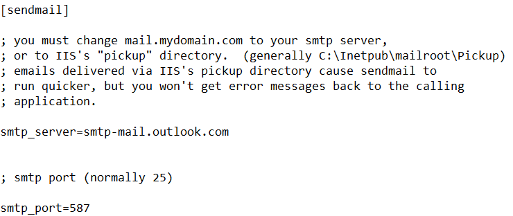
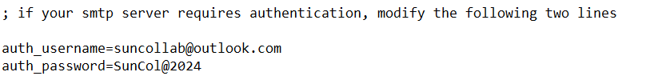

 

    

<h3 align="center">Collaborative Kanban Task Management Tool made by <a href="https://github.com/ShaorenCheah"> Cheah Shaoren & <a href="https://github.com/ChooYJ81">Choo Yan Jie</a></h3>

 

## Description

This project is developed as a requirement of SWE3033 Software Processes in a strict span of six weeks using the waterfall model to develop process models for software process improvement. The team consists of six different members with distinct roles responsible in different phases, which are Cheah Shaoren, Choo Yan Jie, Eugene Davis Goutama, Lim Zi Jie, Sean Tan Ming Sern, Tay Shin Ling.

SunCollab is a collaborative online task management tool that enables the creation, management, and assignment of tasks within a collaborative environment, complete with features for user authentication and authorization. This project is developed using HTML, CSS, JavaScript, PHP, Bootstrap 5, AJAX, JSON, and MySQL database.

Check out the demo video for SunCollab: https://youtu.be/KjR0FvuYGCU

 

## Installation

Softwares required for this project: XAMPP, Apache and, MySQL

1. Install XAMPP and import the files into (`\xampp\htdocs`) in XAMPP folder
2. Open XAMPP control panel and enable Apache and MySQL.
3. Click (`Admin`) on MySQL to access the database
4. Create a new database called (`sptmt`)
5. Import the SQL that can be found in (`\xampp\htdocs\TaskManagementTool\misc\db.sql`)

 

## Configuration

Enable PHP mailing feature

1. Update the SMTP port number and server from (`\xampp\sendmail\sendmail.ini`)
 
 
2. Update the send mail function from (`\xampp\php\php.ini`)
  
-> Update sendmail_from to (`sendmail_from = suncollab@outlook.com`) 
-> Update sendmail_path to (`sendmail_path = "\"C:\xampp\sendmail\sendmail.exe\" -t"`)

** Default sender email is (`suncollab@outlook.com`) with the password of (`SunCol@2024`)

 

## Accessing

To access SunCollab, you can view the user's email from the database. The accounts have a default password of (`12345`) 
Join the sample workspace with the code of (`WKR3J`) to view the workspace
