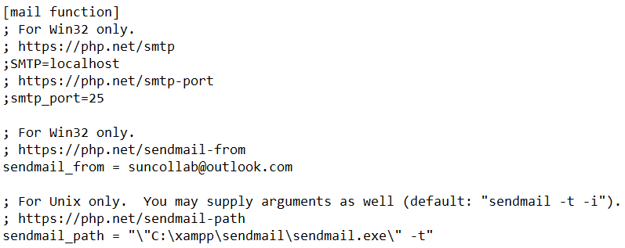

## Installation

Softwares required for this project: XAMPP, Apache and, MySQL

1. Install XAMPP and import the files into (`\xampp\htdocs`) in XAMPP folder
2. Open XAMPP control panel and enable Apache and MySQL.
3. Click (`Admin`) on MySQL to access the database
4. Create a new database called (`sptmt`)
5. Import the SQL that can be found in (`\xampp\htdocs\TaskManagementTool\misc\db.sql`)

 

## Configuration

Enable PHP mailing feature

1. Update the SMTP port number and server from (`\xampp\sendmail\sendmail.ini`)
 
2. Update the send mail function from (`\xampp\php\php.ini`)
  
** Default sender email is (`suncollab@outlook.com`) with the password of (`SunCol@2024`)

 

## Accessing

To access SunCollab, you can view the user's email from the database. The accounts have a default password of (`12345`)
